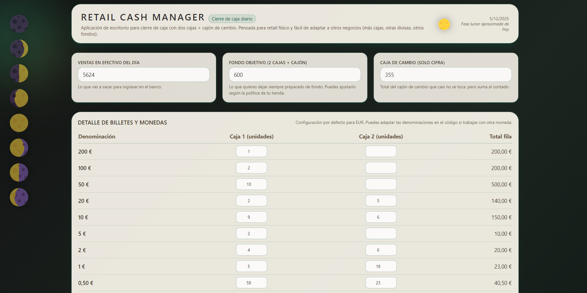
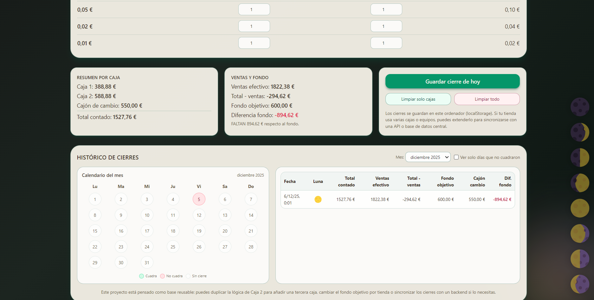

# 💰 Retail Cash Manager – Desktop app para cierres de caja diarios

**Retail Cash Manager** es una aplicación de escritorio (Windows) desarrollada con **Electron + React + TypeScript** para automatizar el cierre de caja diario en tiendas físicas.

Está pensada para negocios que trabajan con **2 cajas + cajón de cambio**, donde cada día hay que:

- Contar billetes y monedas de cada caja,
- Registrar las ventas en efectivo del día,
- Comprobar si el fondo final **cuadra o no cuadra**,
- Guardar un histórico de cierres para revisar después.

## 🖥️ Vista previa

### 🖼️ Vista principal



### 🔴 Día que no cuadra



🚀 ¿Qué hace esta app?

🧮 Cuenta automáticamente el total de efectivo por denominación:

Soporta billetes de 200€, 100€, 50€, 20€, 10€, 5€

Monedas de 2€, 1€, 0,50€, 0,20€, 0,10€, 0,05€, 0,02€, 0,01€

📦 Permite separar:

Caja 1 (un TPV),

Caja 2 (otro TPV),

Cajón de cambio (fondo fijo).

💶 Calcula:

Total contado,

Ventas en efectivo del día,

Total sin ventas (lo que se queda de fondo),

Diferencia respecto al fondo objetivo.

✅ Muestra mensajes claros:

“La caja CUADRA con el fondo.”

“SOBRAN X € respecto al fondo.”

“FALTAN X € respecto al fondo.”

📅 Incluye:

Histórico de cierres guardados en el propio equipo,

Calendario mensual con días:

✅ Que cuadran,

⚠️ Que no cuadran,

⬜ Sin cierre,

Iconos de fases lunares para cada cierre (detalle visual simpático).

🛠️ Tecnologías utilizadas

⚛️ React 18 (con TypeScript)

💻 Electron 30 (aplicación de escritorio para Windows)

⚡ Vite 5 (dev server y build)

💅 Tailwind CSS 3 (estilos)

🔐 ContextBridge + Preload de Electron

---

Estructura relevante:

retail-cash-manager-cierres/
├─ electron/
│ ├─ main.ts # Ventana principal de Electron
│ └─ preload.ts # Bridge seguro entre main y renderer
├─ src/
│ ├─ App.tsx # Lógica de la app (cierre de caja + histórico)
│ ├─ main.tsx # Entrada de React
│ └─ index.css # Estilos globales (Tailwind)
├─ build/
│ └─ icon.ico # Icono de la aplicación (instalador y barra de tareas)
├─ dist/ # Build de React (se genera al compilar)
├─ dist-electron/ # Build de Electron (se genera al compilar)
├─ dist-electron-builder/ # Instaladores (.exe), también auto-generados
├─ package.json
├─ vite.config.ts
├─ tailwind.config.js
└─ README.md

▶️ Cómo ejecutar el proyecto en local

Requisitos:

Node.js instalado (recomendado versión 18 LTS o similar)

1. Clonar el repositorio
   git clone https://github.com/Saquero/retail-cash-manager-cierres.git
   cd retail-cash-manager-cierres

2. Instalar dependencias
   npm install

3. Ejecutar en modo desarrollo
   npm run dev

Esto levanta Vite y Electron. Se abrirá una ventana de escritorio con la app.

🏗️ Generar instalador para Windows

🔒 Nota: en desarrollo no es necesario generar el instalador.
Lo usarías solo para distribuir la app en otros equipos.

Comando:

npm run build:win

Esto genera un instalador .exe en:

dist-electron-builder/

Ejemplo de nombre:

Retail-Cash-Manager-Setup-1.0.0.exe

Ese archivo puedes llevártelo en un USB y usarlo para instalar la app en otros ordenadores.

🧮 Lógica del cierre de caja
Entradas principales

La app te pide:

Unidades de cada billete/moneda en:

Caja 1

Caja 2

Importe del cajón de cambio (solo número).

Ventas en efectivo del día.

Fondo objetivo que quieres dejar (por defecto 600€ pero lo puedes cambiar).

Cálculos que realiza

Total de cada caja a partir de:

unidades \* valorDenominación

Suma:

totalCaja1 + totalCaja2 + cajónCambio

Resta las ventas en efectivo:

totalSinVentas = totalContado - ventasEfectivo

Compara contra el fondo objetivo:

diferencia = totalSinVentas - fondoObjetivo

Con eso decide si:

La caja cuadra (diferencia ≈ 0),

Sobran X euros,

Faltan X euros.

Histórico y calendario

Cada vez que pulsas “Guardar cierre de hoy”:

Se guarda un cierre con:

Fecha y hora,

Totales y diferencia,

Fase lunar del día,

Todo ello se almacena en localStorage, en la clave:

"retail-cash-manager-cierres"

El calendario muestra por día:

Color verde si cuadra,

Rojo si no cuadra,

Grises si no hubo cierre registrado.

🔧 Personalización y posibles mejoras

La arquitectura de la app está pensada para poder adaptarse fácilmente a otros contextos:

Ideas de extensiones futuras:

🏦 Soportar más cajones (3 o más cajas).

🌍 Cambiar divisa (ej. SEK, USD, GBP) con sus denominaciones.

👥 Multiusuario (cada persona registra su cierre).

☁️ Sincronización en red o nube (en lugar de solo localStorage).

📤 Exportar cierres a CSV / Excel.

🔔 Alertas cuando haya demasiados días seguidos sin cuadrar caja.

🤝 Uso real

Esta herramienta nace de la necesidad real de reducir tiempo y errores en el cierre de caja diario de una tienda física:

Evita tener que hacer sumas manuales en la calculadora,

Te da una vista clara de en qué días estás teniendo más descuadres,

Sirve como histórico ligero para revisiones semanales/mensuales.

📘 Licencia

MIT © 2025 Manu Saquero

📬 Contacto

Proyecto creado por Manu Saquero

🌐 GitHub: github.com/Saquero

💼 LinkedIn: linkedin.com/in/manusaquero

📩 ¿Te interesa adaptar esta herramienta a tu comercio o empresa?
Estoy abierto a colaborar, mejorarla o crear nuevas herramientas para automatizar tareas repetitivas en tienda.

```

```
